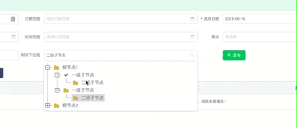

## form 可用的参数
  form 用于点击『添加』和【编辑】时弹出一个模态框，可以进行数据添加。
 - 参数

``` javascript
 //表单提交与修改
    form: {
      name: "",//表单名称，如果同一个页面存在多个表单时，需要指定不同的名称
      //label对齐方式
      labelPosition: "right",
      //label的宽度
      labelWidth: "80",
      //每行显示的个数
      colNumber: 2,
      //模态窗口相关配置
      modal: {
        title: "",//表单标题，默认为添加『查看、添加、修改』两个字.如果为空，则不显示标题
        showClose: true,//是否显示关闭按钮，默认为true
        width: "",//表单弹出框宽度
      },
      //表单要显示的元素
      columns: [
        {"label": "姓名", "type": "text", "name": "name", required: true},
        {"label": "年龄", "type": "text", "name": "age", required: true},
        {
          "label": "省份", "type": "select", "name": "provice",
          items: [{"name": "上海市", "value": "上海市"}, {"name": "北京市", "value": "北京市"},],
          rule: {required: true, message: '请选择省份', trigger: 'change'}
        },
      ],
      //表单提交之前（校验之后），返回如果为false,则不继续执行后续操作
      //data为需要提交表单前的属性
      submitBefore: function (data) {

      },
      //表单提交之后
      submitAfter: function (data) {

      },
      //点击取消时的操作，默认为关闭窗口
      onCancel: function (data) {

      }
    }

```

### title 可以支持添加、编辑、查看三种状态的不同定义

```javascript
 modal: {
                  title: {
                      add:'添加资源',
                      edit:'编辑资源',
                      view:'资源详情'
                  }
                }
```

### columns的作用和配置
 form.columns用于渲染添加、查看、编辑按钮弹出的模态窗口的表单使用。支持各种表单元素类型，可以自定义规则、设置初始值
 针对select类型可以设置各种场景的数据获取方式。
 - label :表单元素的标题
 - name :提交到后台的字段名称
 - init: 表单元素初始值
 - type :表单元素的类型，支持的格式如下：
    - text 对应iview的 Input
    - date
    - number (可以设置min,max属性)
    - email
    - switch
    - password
    - daterange
    - datetime
    - datetimerange
    - cascader 设置data属性来设置级联 ！注意，该类型提交到后端的属性为name+_ ！
      - onChange:(value,data) 用户选择后触发该事件
    - select 下拉框初始值，可以通过一下三种方式获取
      - data:
        - [{"name": "上海市", "value": "上海市"}, {"name": "北京市", "value": "北京市"}] 直接定义个数组
        - "im:typeName"，查询数据字典，其中typeName为要查下的数据库字典类型名称
        - "url:http://www.baidu.com" 查询接口获取数据，其中url:之后的内容为接口查询地址。
    - treeSelect 树状下拉框
      
      - tree 二维数组，树数据。要求与UTree相同
      - fixed 更多属性参见UTreeSelect组件定义
      - size 
 - required: 是否为必填，如果为true,则会默认显示红色*并在表单提交的时候进行必填校验
 - equalsTo 可以用来校验输入的内容与另外一个元素是否一致，如确认密码与密码需要一致
    > 示例
    
    ```javascript
       {label: '密码', type: 'password', name: 'password', required: true,edit:{show:false},view:{show:false}},
                   {label: '重复密码', type: 'password', name: 'password2',required:true,edit:{show:false},view:{show:false}
                     ,equalsTo:'password'
       }
    ```    
 - rules 当需要进行更多自定义校验规则时，可以自己写rules来实现，具体参考iview的文档https://www.iviewui.com/components/form
 - focus :点击事件，可以针对text设置点击事件
 - fieldFormat(value,row) :编辑时，如果需要针对当前列进行额外处理，可以在这个事件里面处理。value为当前列的值，row为整行的值。

  当type为date、datetime\datarange之类的类型时，再点击编辑按钮时有可能会提示表单校验报错：value.getTime() is not function 。这个时候需要通过fieldFormat方法将字符串的值，转为date类型的格式


### 针对添加、编辑、查看表单需要自定义表单元素的做法
在定义表单的columns时，可以增加如下选项用于控制在不同功能内显示不同的表单元素

``` javascript
  {
    "label": "渠道", "type": "text", "name": "channel", rule: {}, prepend: "http://", append: ".com",
    add: {
      show: false
    },
    edit: {
      show: true, disabled: true
    },
    view: {
      show: false
    }
  }
```
- add 表单添加时的控制，可以为空，默认show为true,disabled为false.
- edit 表单编辑时候控制
- view 表单查看时候控制。
以上三个属性，可以都为空。
