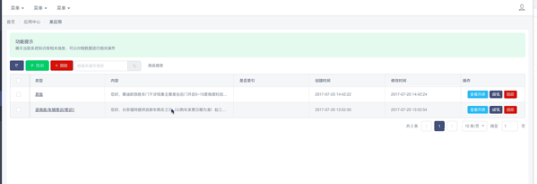

## 1.table 可用的参数
  
  table表格现在完全使用iview的组件，除了自定义增加了最后一列的操作功能（默认自带，可以去掉）。没有额外增加定义的内容。

```javascript
table: {
      ref: "demoTable",//默认'table'导出是使用，
      stripe: true, noDataText: "已努力查询，但还是没找到！",
      //操作列有关参数
      operation: {
        //调用查看、编辑、删除接口时，需要传递的参数主键名称，可以有多个。默认为id
        primaryKey: ["id"],
        //是否显示操作列
        show: true,
        //查看、编辑功能是否通过远程查询方式获取。默认为false直接用当前行数据展示
        remote: false,
        //操作按钮，针对查看、编辑、删除的按钮。
       buttons: [{
         key: "view", show: true, "label": "查看", "theme": "text", click: ( row, index,_this) => {
           _this.optViewClick(row, index);
         }
       }, {
         key: "edit", show: true, "label": "编辑", "theme": "primary", click: (row, index,_this) => {
           _this.optEditClick(row, index);
         }
       }, {
         key: "delete", show: true, "label": "删除", "theme": "error", click: (row, index,_this) => {
           _this.optDeleteClick(row, index);
         }
       }],
      //默认的操作列内容。可以通过复写这个来重写自己的操作列
       column: {
         title: '操作',
         key: 'action',
         width: 160
       }
      },
      data: []
 }

```
- 参数说明
  - minWidth 表格最小宽度（推荐设置改值）
  - size 表格大小，通过设置属性 size 为 large 或 small 可以调整表格尺寸为大或小，默认不填或填写 default 为中。
  - width 表格宽度
  - height 表格高度 ，根据窗口设值 `height: document.documentElement.clientHeight - 400` 后面的400根据页面高度自己设定
  - showCheckbox 是否在第一列显示复选框
  - operation 最后一列的操作列
    - primaryKey: 字符串类型用于做删除、查看、编辑时调用后台接口传递参数使用。这里的字段来自当前点击的那一行的对象。
    - show: 是否显示操作列
    - remote: false ,查看、编辑功能是否调用远程接口进行查询。
    - buttons: 操作按钮，针对查看、编辑、删除的按钮，如有自定义按钮，可以按照上面的格式自行添加。
        - view 点击查看时候的事件
        - edit 点击编辑时候的事件
        - delete 点击删除时候的事件
        示例代码是默认的三个按钮，如果需要替换其中某一个或者隐藏某一个，需要将三个按钮同时定义，事件会传递三个参数
          - _this 当前vue实例
          - row 当前选中的行数数据
          - index 当前选择的行数索引
    - column: 最后一列的操作事件，属性定义参考iview table当中对column的定义
  - columns:定义用来显示的列，具体的参数参考iview。在这个基础上增加了额外两个参数
     - renderType:
        - tooltip 内容过长时，默认隐藏。采用tooltip方式显示
          - contentFormat(value,row) 针对tooltip的内容提供一套自定义内容事件，可在这个方法当中处理，并返回即可
        - a 提供超链接方式，同时提供一个click事件
          - click(row) 只有在renderType:a的情况下有用，row为当前行数据
          - 示例：
           
     - fieldFormat(value,row)（v1.5.12新增）可以自行在这个方法里面进行数据格式化处理,对查询返回的值进行处理
     兼容老的format方法
        - value 当前原始数据
        - row 当前一行的数据
      
```javascript
    {
            title: '类型',
            key: 'typeName',
            renderType:"a", //click事件只在renderType为a时有效
            click:function (row) {
                console.log(row);
                alert("haha")
            }
          },
          {
            title: '内容',
            key: 'content',
            fieldFormat(value,row){
              //1.根据条件返回不同的值
              return value;  
          },
          {title: '是否启用', 
            key: 'available',
            fieldFormat:(value,row)=>{
            //2.如果需要单元格有不一样的样式，可以返回一个cellClassName，自己编写这个className样式
             return {value:value?'是':'否',cellClassName:'greenCellClassName'}
          },
          //自定义toolTip内容
          {title: '资源类型', key: 'resourceType', minWidth: 100
                          ,renderType:'tooltip'
                          ,contentFormat:(value,row)=>{
                            return value+"自定义内容"
           }}
  }
```
```css
  .greenCellClassName {
    background-color: #187 !important;
    color: #fff;
  }
```

> 对于fieldFormat方法，可以只返回一个具体的值，也可以返回一个包含有cellClassName属性的对象
这个className会作用于当前单元格上，如果需要自定义样式，只需要写对应的cssD代码即可


## 2. page 可用的参数
```javascript
    pageable: { //分页数据，默认为从第一页开始，每页大小为15条
        page: 1,
        size: 15
      }
```

## 3. 修改最后操作列当中的按钮
> 默认表格是最后一列为操作列，可以隐藏，也可以增加自己的按钮或者修改默认的按钮功能

- 3.1 默认的配置为
```javascript
table:{
  operation:{
    //操作按钮，针对查看、编辑、删除的事件。定义了事件则使用自定义事件
    buttons: [{
        key: "view", show: true, "label": "查看", "theme": "primary", click: (row, index, _this) => {
          _this.optViewClick(row, index);
        }
      }, {
        key: "edit", show: true, "label": "编辑", "theme": "primary", click: (row, index, _this) => {
          _this.optEditClick(row, index);
        }
      }, {
        key: "delete", show: true, "label": "删除", "theme": "default", click: (row, index, _this) => {
          _this.optDeleteClick(row, index);
        }
      }],
     //默认的操作列内容。可以通过复写这个来重写自己的操作列
    column: {
      title: '操作',
      key: 'action',
      className: 'optColumn',
      width: 160
    }
  }
}
      
```
> 通过对buttons数组来增加、删除、修改的方式实现自定义功能。其中默认的三个功能又对应的事件处理


- 3.2 示例：增加一个按钮为`重置密码`，配置如下

>要求：增加按钮时，需要将默认的3个按钮一块配置上去

```javascript
table:{
  operation:{
    //操作按钮，针对查看、编辑、删除的事件。定义了事件则使用自定义事件
    buttons: [{
        key: "view", show: true, "label": "查看", "theme": "primary", click: (row, index, _this) => {
          _this.optViewClick(row, index);
        }
      }, {
        key: "edit", show: true, "label": "编辑", "theme": "primary", click: (row, index, _this) => {
          _this.optEditClick(row, index);
        }
      }, {
        key: "delete", show: true, "label": "删除", "theme": "default", click: (row, index, _this) => {
          _this.optDeleteClick(row, index);
        }
      },{
         show: true, "label": "重置密码", "theme": "primary", click: (row, index, _this) => {
          //这里写自己的业务逻辑，比如弹出窗口进行表单录入
        }
      }],
    
  }
}

```


