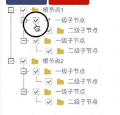

> 树结构组件

## 1.图例


## 2.UTree 使用方式

```html
 <template>
   <div>
     <Row>
       <Col :span="8">
         <u-tree v-model="selectTreeItem" :tree="tree"  :showCheckbox="options.showCheckbox" ref="uetree"></u-tree>
       </Col>
     </Row>
   </div>
 </template>
```
```javascript
 
  export default {

    data () {
      return {
        tree: [
          {id: 1, "name": "根节点1", parentId: null,opened:true},
          {"name": "一级子节点", id: 2, parentId: 1,icon:'fa fa-check icon-state-success'},
          {"name": "一级子节点", id: 3, parentId: 1},
          {"name": "二级子节点", id: 4, parentId: 2},
          {"name": "二级子节点", id: 5, parentId: 3},
          {id: 6, "name": "根节点2", parentId: null},
          {"name": "一级子节点", id: 7, parentId: 6},
          {"name": "一级子节点", id: 8, parentId: 6},
          {"name": "二级子节点", id: 9, parentId: 7},
          {"name": "二级子节点", id: 10, parentId: 8},

        ],

        options:{
          showCheckbox:true,
          multiple:true,
          allowBatch:true,
          wholeRow:true
        },
      //当前选择的树节点，通过双向绑定获取到选择的值，返回的格式为{"name": "一级子节点", id: 3, parentId: 1}
        selectTreeItem: null,
      //  sort:{"sort":"desc","field":"id"}
      }
    },
    methods: {

    }
  }

```

## 3.API

| Props        | Type           | Default  |  Describe  |
| ------------- |:-------------:|:-----:|:--------------------------------------------------------|
| tree      | Array |  |  数组，需要有id,parentId,name，3个必备属性  |
| showCheckbox | Boolean      |    false |  设置是否显示复选框 |
| wholeRow | Boolean      |    false |   |
| collapse | Boolean      |    false |  设置节点是否全部展开 |
| multiple | Boolean      |    false |  是否允许多选  |
| allow-batch | Boolean      |    true |  允许批量选择（勾选父节点，默认选择子节点） |
| klass | String      |     |  追加自定义tree的样式 |
| maxHeight | Number      | 400    |  设置树组件弹出框最大高度，超过后自动出现滚动条 |
| async | Boolean      | false    |   是否使用异步方式加载数据|
| asyncFun | Function      |     |  异步加载时的回调方法，需要再这里返回下一层数据和初始数据 |


tree数据格式示例：
```javascript
[
          {id: 1, "name": "根节点1", parentId: null,opened:true},
          {"name": "一级子节点", id: 2, parentId: 1,icon:'fa fa-check icon-state-success'},
          {"name": "一级子节点", id: 3, parentId: 1},
          {"name": "二级子节点", id: 4, parentId: 2},
          {"name": "二级子节点", id: 5, parentId: 3},
          {id: 6, "name": "根节点2", parentId: null},
          {"name": "一级子节点", id: 7, parentId: 6},
          {"name": "一级子节点", id: 8, parentId: 6},
          {"name": "二级子节点", id: 9, parentId: 7},
          {"name": "二级子节点", id: 10, parentId: 8},

        ]
```

## 4.事件

**@item-click(node, item, e)**

**@item-toggle(node, item, e)**

**@item-drag-start(node, item, e)**

**@item-drag-end(node, item, e)**

**@item-drop-before(node, item, draggedItem, e)**

**@item-drop(node, item, draggedItem, e)**

**getCheckedNodes** ：获取当前用户勾选的所有节点ID，返回格式为数组
示例：
```javascript
//一定要为组件添加一个ref，名称为utree,可以改为其他名称
  let checkedNodes = this.$refs["utree"].getCheckedNodes();

```


**node** : 当前选择的节点

**item** : 当前选择的节点数据，返回的value值包含{id:id,value:name}

**e** : event

**asyncFun** 异步加载数据
- 示例：
```javascript

asyncLoadData(oriNode, callback) {
    let id = oriNode.id ? oriNode.id : 0
    if(oriNode.data){
        id = oriNode.data.id
    }
    //根据ID获取子节点数据
    //this.parentTreeData 为自定义的结构的数据，目的就是根据当前点击的节点ID查找到子节点
    let child = this.parentTreeData[id].children||[]
    //判断每个子节点是否还有子节点，没有子节点则设置样式为没有+号
    child.forEach((c)=>{
        if(!this.parentTreeData[c.id]){
            c.isLeaf = true
        }
    })
    //一定要执行该方法
    callback(child)
}

```


## 5.tree数据格式可选属性

| 名称        | 类型           | 默认值  | 描述  |
| ------------- |:-------------:| -----:|:----------------------------------------------|
| icon      | String      |   | 自定义icon样式，支持font-awesome的样式如：fa fa-check icon-state-success |
| opened | Boolean      |    false | 设置节点是否默认打开 |
| selected | Boolean      |    false | 设置节点是否默认选中 |
| disabled | Boolean      |    false | 设置节点是否可选 |
| isLeaf | Boolean      |    false | 设置当前为叶子节点，则不会显示前面的+符号 |
| dragDisabled | Boolean      |    false |  禁用drag |
| dropDisabled | Boolean      |    false |   禁用 drop |

## 6.原型组件
当前组件基于以下组件封装而成，简化了数据结构，无需构建树结构数据即可使用。
更多示例：[vue-jstree](https://zdy1988.github.io/vue-jstree/)
