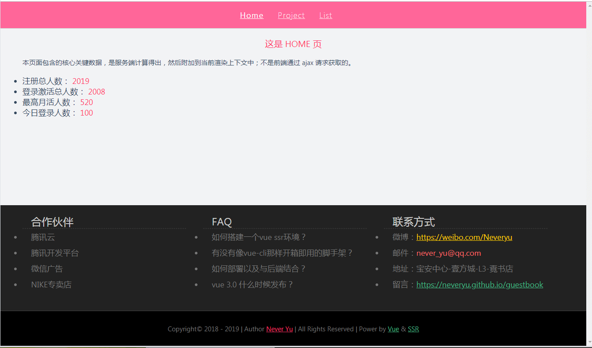

# 这是一个 vue ssr 的教学课程

>手把手带你学会 vue 的服务端渲染

本课程的内容是基于 vue ssr 的文档来的，课程的结果是完成一个 vue 服务端渲染的实例。
所以在学习本课程的时候，建议你打开 [vue ssr](https://ssr.vuejs.org/zh/) 的文档，这样有助于理解。

本课程所包含的几个小节，都是**循序渐进**的，**由易到难**，每一个小节都是在前一个小节的基础上，添加新的内容，幅度平缓，易学易懂。

小提示：建议配合着 [vue ssr](https://ssr.vuejs.org/zh/) 的文档来学习本课程。

本课程内容如下：

|【基础篇】|【中级篇】|【附加篇】
|:---:|:---:|:---:|
|[Lesson1](#lesson1)|[Lesson4](#lesson4)|[Lesson7](#lesson7)|
|[Lesson2](#lesson2)|[Lesson5](#lesson5)|
|[Lesson3](#lesson3)|[Lesson6](#lesson6)|

### 预览 - preview



**[⬆ 返回顶部](#这是一个-vue-ssr-的教学课程)**

**[➷ 开始学习吧](#lesson1)**


--------------


<p align="center"><b>【基础篇】</b></p>

## lesson1

用最简单，明白的方式创建一个 vue 服务端渲染的应用程序。
``` js
// 第 1 步：创建一个 Vue 实例
const Vue = require('vue')
const app = new Vue({
  template: `<div>Hello World</div>`
})

// 第 2 步：创建一个 renderer
const renderer = require('vue-server-renderer').createRenderer()

// 第 3 步：将 Vue 实例渲染为 HTML
// 在 2.5.0+，如果没有传入回调函数，则会返回 Promise：
renderer.renderToString(app).then(html => {
  console.log(html)
  // => <div data-server-rendered="true">Hello World</div>
}).catch(err => {
  console.error(err)
})
```
课程 1 的运行步骤：
``` bash
cd lesson1
npm i
npm start
```
然后会在命令行看到输出内容： 

``` html
<div data-server-rendered="true">Hello World</div>
```

**[⬆ 返回顶部](#这是一个-vue-ssr-的教学课程)**

-------------------

## lesson2

**内容**：与服务器集成，使用 Express 作为服务器提供服务；

课程 2 的运行步骤：
``` bash
cd lesson2
npm i
npm start
```
浏览器访问 [http://localhost:8888](http://localhost:8888)

**[⬆ 返回顶部](#这是一个-vue-ssr-的教学课程)**

-------------------

## lesson3

**内容**：使用一个页面模板 `index.template.html`。

课程 3 的运行步骤：
``` bash
cd lesson3
npm i
npm start
```
浏览器访问 [http://localhost:8888](http://localhost:8888)

<p align="center"><b>本节内容讲解</b></p>

`renderer` 只从应用程序生成 HTML 标记(markup)，如果不提供模板的话，那么生成的 HTML 标记就应该是一个完整的 html 内容。

在这节中，我们提供一个额外的 HTML 模板，作为页面包裹容器，来包裹 `renderer` 生成的 HTML 标记。

同时，模板还支持简单插值。我们可以通过传入一个 “渲染上下文对象” `context`，作为 `renderToString` 函数的第二个参数，来提供插值数据。

**[⬆ 返回顶部](#这是一个-vue-ssr-的教学课程)**

-------------------

<p align="center"><b>【中级篇】</b></p>

## lesson4


与纯客户端开发模式不同，服务端渲染的最终结果是生成 `Client Bundle` 和 `Server Bundle`。

在这一章，我们会添加 `entry-client.js` 和 `entry-server.js` 分别作为客户端和服务端的入口。`app.js` 是通用的入口，供 `entry-client.js` 和 `entry-server.js` 共同使用。所以 `entry-client.js` 和 `entry-server.js` 中都会引入 `app.js`。

课程 4 的运行步骤：
``` bash
cd lesson4
npm i
npm start
```
浏览器访问 [http://localhost:8888](http://localhost:8888)

与此同时，这一节中，`webpack` 也要加上了。

【至于 `webpack` 的配置，感兴趣的可以看一下，比较简单。】

**[⬆ 返回顶部](#这是一个-vue-ssr-的教学课程)**

------------------------

## lesson5
**内容**：这一节，加入 `vue-router` 来实现路由的功能。

课程 5 的运行步骤：
``` bash
cd lesson5
npm i
npm start
```
浏览器访问 [http://localhost:8888](http://localhost:8888)

路由 `vue-router` 的添加是比较容易的；新建一个目录 `router` 并创建一个路由实例，然后 `app.js`、`entry-client.js`、`entry-server.js` 有小幅改动。

**[⬆ 返回顶部](#这是一个-vue-ssr-的教学课程)**

------

## lesson6
**内容**：这一节实现【数据】

<p align="center"><b>本节内容讲解</b></p>

我们知道，服务端渲染最重要的部分就是“数据”了。既然是服务端渲染，那么就应该是服务端将运算处理后的数据填到应用程序中，然后将整个应用程序返回到前端。所以**在服务端渲染过程之前，需要先预取和解析好这些数据。**

另一个需要关注的问题是在客户端，在挂载 (mount) 到客户端应用程序之前，需要获取到与服务器端应用程序完全相同的数据 - 否则，客户端应用程序会因为使用与服务器端应用程序不同的状态，然后导致混合失败。

【在这里需要好好的思考一下，vue 的服务端渲染是如何实现的？如何理解 “客户端应用程序会因为使用与服务器端应用程序不同的状态，然后导致混合失败” 这句话？第 4 节中的 vue 服务端渲染结构图是否理解清楚了？】

我们在服务端预取和解析数据的时候，将这些数据填充到“状态容器(state container)”中，然后客户端也使用这里面的数据，就可以保证客户端与服务器端拥有相同的状态了。【状态容器如何实现？】

我们使用 vuex 来作为“状态容器”，此外，我们将在 HTML 中序列化(serialize)和内联预置(inline)状态。这样，在挂载(mount)到客户端应用程序之前，可以直接从 store 获取到内联预置(inline)状态。

课程 6 的运行步骤：
``` bash
cd lesson6
npm i
npm start
```
浏览器访问 [http://localhost:8888](http://localhost:8888)

本次更新内容较多，详细的说明请看这里 => [Lesson6](./lesson6)

**[⬆ 返回顶部](#这是一个-vue-ssr-的教学课程)**

<p align="center"><b>【附加篇】</b></p>

## lesson7
**内容**：这一节增加了一些额外的辅助工具【`gzip`、缓存、`favicon`、`title`】；然后增加了生产环境的打包和运行命令。

课程 7 的开发运行步骤：

``` bash
cd lesson7

# install dependencies
npm install

# serve in dev mode, with hot reload at localhost:8080
npm run dev
```

课程 7 打包 server 运行步骤：

``` bash
# build for production（打生产环境的包）
npm run build

# serve in production mode（运行生产环境）
npm run server
```
本次更新内容较多，详细的说明请看这里 => [Lesson7](./lesson7)

**[⬆ 返回顶部](#这是一个-vue-ssr-的教学课程)**

# 交流

交流学习 QQ 群：685486827，<a target="_blank" href="//shang.qq.com/wpa/qunwpa?idkey=32da7a18744756b0d8ffdd05b84999afecb5265dbad0fb119033e122abe803f3">一键加群</a>


**[⬆ 返回顶部](#这是一个-vue-ssr-的教学课程)**

# 额外知识点总结

1、我们在前三节使用的都是 `vue-server-renderer` 中的 `createRenderer` 方法；从第四节开始，我们使用的是 `createBundleRenderer`，所创建的 `bundle renderer`，用法和普通 `renderer` 相同。
`createBundleRenderer` 接收一个 `server bundle` 生成的特殊 JSON 文件。但是 `bundle renderer` 提供以下优点：

- 内置的 `source map` 支持（在 `webpack` 配置中使用 `devtool: 'source-map'`）

- 在开发环境甚至部署过程中热重载（通过读取更新后的 `bundle`，然后重新创建 `renderer` 实例）

- 关键 `CSS(critical CSS)` 注入（在使用 `*.vue` 文件时）：自动内联在渲染过程中用到的组件所需的CSS。更多细节请查看 CSS 章节。

- 使用 `clientManifest` 进行资源注入：自动推断出最佳的预加载(preload)和预取(prefetch)指令，以及初始渲染所需的代码分割 chunk。

2、 **手动资源注入**

默认情况下，当提供 `template` 渲染选项时，资源注入是自动执行的。但是有时候，你可能需要对资源注入的模板进行更细粒度 (`finer-grained`) 的控制，或者你根本不使用模板。在这种情况下，你可以在创建 `renderer` 并手动执行资源注入时，传入 `inject: false`。  [>>点击查看详情](https://ssr.vuejs.org/zh/guide/build-config.html#%E5%AE%A2%E6%88%B7%E7%AB%AF%E9%85%8D%E7%BD%AE-client-config)

3、 **css提取**

**css提取**可以说是一个很重要的知识点；不光在 vue 的服务端项目中，几乎在任何前端项目中，我们都希望 `css`可以单独提取出来，这样可以对文件进行缓存以及部署 CDN。

【启用 `css` 提取】

> css 提取应该只用于生产环境，这样我们在开发过程中仍然可以热重载

要从 `*.vue` 文件中提取 CSS，可以使用 `vue-loader` 的 `extractCSS` 选项（需要 `vue-loader 12.0.0+`）

``` js
// webpack.config.js
const ExtractTextPlugin = require('extract-text-webpack-plugin')

// CSS 提取应该只用于生产环境
// 这样我们在开发过程中仍然可以热重载
const isProduction = process.env.NODE_ENV === 'production'

module.exports = {
  // ...
  module: {
    rules: [
      {
        test: /\.vue$/,
        loader: 'vue-loader',
        options: {
          // enable CSS extraction
          extractCSS: isProduction
        }
      },
      // ...
    ]
  },
  plugins: isProduction
    // 确保添加了此插件！
    ? [new ExtractTextPlugin({ filename: 'common.[chunkhash].css' })]
    : []
}
```

请注意，上述配置仅适用于 `*.vue` 文件中的样式，然而你也可以使用 `<style src="./foo.css">` 将外部 CSS 导入 Vue 组件。

如果你想从 JavaScript 中导入 CSS，例如，`import 'foo.css'`，你需要配置合适的 loader：
``` js
module.exports = {
  // ...
  module: {
    rules: [
      {
        test: /\.css$/,
        // 重要：使用 vue-style-loader 替代 style-loader
        use: isProduction
          ? ExtractTextPlugin.extract({
              use: 'css-loader',
              fallback: 'vue-style-loader'
            })
          : ['vue-style-loader', 'css-loader']
      }
    ]
  },
  // ...
}
```

【从依赖模块导入样式】

在使用 CSS 提取 + 使用 `CommonsChunkPlugin` 插件提取 vendor 时，如果提取的 CSS 位于提取的 `vendor chunk` 之中，`extract-text-webpack-plugin` 会遇到问题。为了解决这个问题，请避免在 `vendor chunk` 中包含 CSS 文件。客户端 webpack 配置示例如下：
``` js
module.exports = {
  // ...
  plugins: [
    // 将依赖模块提取到 vendor chunk 以获得更好的缓存，是很常见的做法。
    new webpack.optimize.CommonsChunkPlugin({
      name: 'vendor',
      minChunks: function (module) {
        // 一个模块被提取到 vendor chunk 时……
        return (
          // 如果它在 node_modules 中
          /node_modules/.test(module.context) &&
          // 如果 request 是一个 CSS 文件，则无需外置化提取
          !/\.css$/.test(module.request)
        )
      }
    }),
    // 提取 webpack 运行时和 manifest
    new webpack.optimize.CommonsChunkPlugin({
      name: 'manifest'
    }),
    // ...
  ]
}
```

**[⬆ 返回顶部](#这是一个-vue-ssr-的教学课程)**


